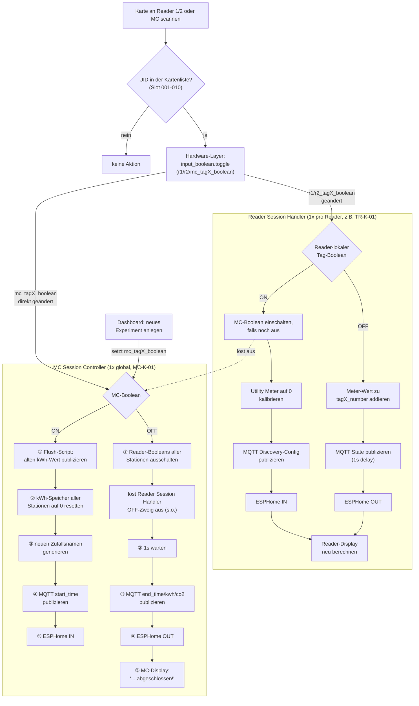

# SmInt Tagreader — Ablaufdiagramm

Aktueller Stand nach allen Bugfixes (siehe [KONTEXT.md](KONTEXT.md) für Details zu jedem Schritt).

Der Ablauf ist derselbe für jede Karte — die Blueprints suchen zu Beginn den zur auslösenden Entity gehörenden Karten-Eintrag heraus (`this_tag`) und durchlaufen den Graphen dann genau einmal. Ob es sich um Karte 001 oder 010 handelt, ändert nur die verwendeten Entities, nicht den Weg.

Die nummerierten Schritte markieren Reihenfolgen, die früher zwischen mehreren separaten, parallel laufenden Automationen zufällig waren und jetzt durch die Konsolidierung in [tagreader_mc_session_controller.yaml](tagreader_mc_session_controller.yaml) garantiert sind:

- **ON-Zweig**: Flush vor Reset vor Namensgenerierung — sonst würde der alte kWh-Wert nach dem Reset als 0 "geflusht".
- **OFF-Zweig**: Reader-Booleans zuerst ausschalten (das triggert den Reader Session Handler, der den finalen kWh-Wert erst befüllt), dann erst die finalen kWh/CO2-Werte publizieren — sonst wird beim direkten MC-Checkout ohne vorherigen Reader-Checkout fälschlich 0 veröffentlicht.
