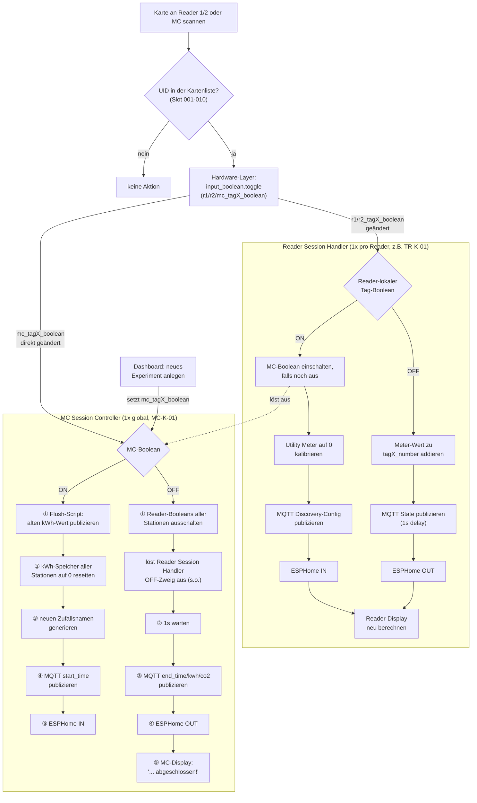

# Architektur

Wie die drei Blueprints zusammenspielen, was durch das System fließt und warum es
in genau diese drei Schichten geschnitten ist.

## Das Problem, das das System löst

An mehreren Messstationen (z. B. einer Mikrowelle, einem Trockenschrank, einem
Laborgerät) soll erfasst werden, **wer** wie viel **Energie, Wasser und CO₂**
verbraucht hat — und zwar gebündelt pro *Experiment*, nicht pro Gerät.

Die Kopplung zwischen Person und Messung läuft über eine RFID-Karte. Ein
Experiment ist der Zeitraum zwischen zwei Scans derselben Karte am zentralen
Checkout-Reader. Alles, was in diesem Zeitraum an beliebigen Stationen gemessen
wurde, wird am Ende zu einem MQTT-Gerät zusammengefasst, das nach dem Experiment
benannt ist.

## Rollen der Geräte

| Rolle | Beispiel-ID | Aufgabe |
|---|---|---|
| **MC-Reader** (Master Checkout) | `MC-K-01` | Startet und beendet eine komplette Experiment-Session. Genau einer pro Anlage. |
| **Stations-Reader** | `TR-K-01`, `TR-K-02` | Sitzt an einer Messstation. Ein Scan checkt die Karte dort ein bzw. aus. Beliebig viele. |
| **RFID-Karte** | Tag 001 … 010 | Identifiziert Nutzer:in bzw. Experiment. Kann an jedem Reader gescannt werden. |

Die Reader sind ESPHome-Geräte mit RFID-Leser und Display. Beim Scannen legt die
Firmware die UID der Karte als **State eines Home-Assistant-Sensors** ab — das ist
die einzige Schnittstelle, die dieses Repo von der Hardware voraussetzt.

## Die drei Schichten

Jede Schicht ist ein eigenes Blueprint und kennt die darüberliegende nicht.
Verbunden sind sie ausschließlich über `input_boolean`-Helfer.

```
  ESPHome-Reader-Sensor (UID als State)
            │
            ▼
  ┌───────────────────────────────────────────────┐
  │ 1. Hardware-Layer                             │  1x für die ganze Anlage
  │    tagreader_inpput_boolean_1_1.yaml          │
  │    UID + Reader  ──►  input_boolean.toggle    │
  └───────────────────────────────────────────────┘
            │                        │
   r1…r9_tagN_boolean          mc_tagN_boolean
            │                        │
            ▼                        ▼
  ┌──────────────────────┐  ┌──────────────────────────┐
  │ 2. Reader Session    │  │ 3. MC Session Controller │  1x global
  │    Handler           │  │    Session-Lebenszyklus  │
  │    1x pro Station    │──►  (schaltet beim Checkout │
  │    misst und meldet  │  │   die Reader-Booleans)   │
  └──────────────────────┘◄─└──────────────────────────┘
            │                        │
            └────────► MQTT ◄────────┘
```

### Schicht 1 — Hardware-Layer

Datei: [tagreader_inpput_boolean_1_1.yaml](../tagreader_inpput_boolean_1_1.yaml)

> Der Tippfehler „inpput" im Dateinamen ist historisch und wurde bewusst **nicht**
> korrigiert: die Raw-GitHub-URL dieser Datei steckt in bestehenden
> Home-Assistant-Blueprint-Importen. Eine Umbenennung würde einen Re-Import
> erzwingen und alle daraus erzeugten Automationen ins Leere zeigen lassen.

Eine einzige Automation für die **gesamte** Anlage: 1 MC-Reader plus bis zu
9 Stations-Reader, jeweils mit bis zu 10 Karten.

Der Ablauf ist bewusst minimal:

1. `state`-Trigger auf jedem der 10 Reader-Sensoren, jeder mit eigener Trigger-ID
   (`mc`, `r1` … `r9`).
2. Leere und ungültige States (`unknown`, `unavailable`, leerer String, `none`)
   werden verworfen — sonst würde ein leerer Reader-State auf einen leeren
   UID-Slot matchen.
3. Die gescannte UID wird in der Kartenliste gesucht.
4. **Der Trick:** die Trigger-ID ist zugleich der Schlüssel im Karten-Dict. Der
   gesamte Lookup ist ein einziges `hit[0].get(trigger.id, '')` — unabhängig
   davon, wie viele Reader-Slots es gibt.
5. `input_boolean.toggle` auf das gefundene Ziel.

`mode: queued`, `max: 25` — zwei schnell aufeinanderfolgende Scans gehen dadurch
nicht verloren, sondern werden nacheinander abgearbeitet.

Ab hier ist die Hardware vollständig entkoppelt: die Schichten 2 und 3 wissen
nichts von Readern, UIDs oder ESPHome, nur noch von Booleans.

> **Toggle-Semantik:** Der Boolean ist die Quelle der Wahrheit, nicht die Karte.
> Ein verpasster oder doppelter Scan invertiert den Zustand dauerhaft. Siehe
> [Betrieb und Fehlersuche](betrieb.md#karte-scheint-verkehrt-herum-eingeloggt).

### Schicht 2 — Reader Session Handler

Datei: [tagreader_reader_session_handler.yaml](../tagreader_reader_session_handler.yaml)

**Einmal pro Stations-Reader instanziiert.** Triggert auf die 10 reader-lokalen
Tag-Booleans.

*Einchecken (Boolean → `on`):*

1. MC-Boolean einschalten, falls es noch `off` ist (startet implizit eine Session).
2. Utility Meter der Station per `utility_meter.calibrate` auf `0` setzen — ab
   hier zählt er das Delta genau dieser Nutzung.
3. MQTT-Discovery-Config für den Experiment-Sensor publizieren.
4. Für jeden konfigurierten Zusatzsensor: ggf. dessen Meter kalibrieren und
   dessen Discovery-Config publizieren.
5. ESPHome-IN-Aktion ausführen (z. B. Relais schalten, Ton am Display).

*Auschecken (Boolean → `off`):*

1. Meter-Delta auf den `input_number`-Speicher aufaddieren.
2. 1 s warten — damit der neue `input_number`-State gesetzt ist, bevor er im
   nächsten Schritt wieder gelesen wird.
3. MQTT-State publizieren.
4. Dasselbe je Zusatzsensor (aufaddieren bzw. Passthrough, 1 s, publizieren).
5. ESPHome-OUT-Aktion.

*In beiden Fällen danach:* Der Display-Text dieses Readers wird per Jinja-Template
neu berechnet — entweder `Bitte Karte scannen!` oder die Liste der eingeloggten
Karten-Labels.

**Zusatzsensoren:** Jede Karte hat ein freies Listenfeld für beliebig viele
weitere Messgrößen (Argon, Stickstoff, Gas, …). Zwei Betriebsarten:

- **Meter-basiert** (`meter_entity` gesetzt): verhält sich wie der primäre
  kWh-Sensor — beim Einchecken kalibrieren, beim Auschecken aufaddieren.
  `value_entity` muss dann ein `input_number` sein.
- **Passthrough** (kein `meter_entity`): der aktuelle Wert von `value_entity`
  wird beim Auschecken 1:1 übernommen. Für bereits vorberechnete Sensoren.

### Schicht 3 — MC Session Controller

Datei: [tagreader_mc_session_controller.yaml](../tagreader_mc_session_controller.yaml)

**Einmal global instanziiert.** Triggert auf die 10 MC-Booleans, und zwar mit
expliziten Übergängen: `off`→`on` liefert Trigger-ID `ON`, `on`→`off` liefert `OFF`.

Die eigentliche Aufgabe dieses Blueprints ist **garantierte Reihenfolge**. Früher
war die Session-Logik auf mehrere parallel laufende Automationen verteilt, mit den
entsprechenden Race Conditions — siehe
[Entscheidungen und Historie](entscheidungen.md#bereits-gefixte-bugs).

*Session-Start (`ON`):*

1. **Flush-Script** der Karte: publiziert den noch nicht abgeholten kWh-Wert der
   *vorherigen* Session per MQTT. Muss vor dem Reset laufen, sonst wird eine 0
   geflusht.
2. **Reset**: alle kWh-Speicher dieser Karte über alle Stationen auf `0`.
3. **Neuer Experimentname**: `YYYYMMDD_<Basis-Name>_<4 Zufallszeichen>`.
   Dieser Name ist zugleich die MQTT-Geräte-Identität der Session.
4. MQTT `start_time` (Discovery-Config + State).
5. ESPHome IN.

*Session-Ende (`OFF`):*

1. **Reader-Booleans aller Stationen ausschalten** — das triggert Schicht 2, die
   dadurch den letzten Messwert noch einträgt.
2. 1 s warten.
3. MQTT `end_time`, `kwh`, optional `l` (Wasser), `co2`.
4. ESPHome OUT.
5. MC-Display: `<Experimentname> abgeschlossen!`

## Warum listengetrieben

Alle drei Blueprints arbeiten intern nach demselben Muster:

```yaml
- variables:
    tag_defs:                       # 10 Einträge, aus den !input-Feldern gebaut
      - { label: "001", boolean: !input tag1_boolean, ... }
      # ...
- variables:
    this_tag: "{{ (tag_defs | selectattr('boolean','eq', trigger.entity_id)
                            | list | first) | default({}, true) }}"
- condition: template               # Sicherheitsnetz
  value_template: "{{ this_tag | length > 0 }}"
# ... ab hier genau ein generischer Durchlauf
```

Statt eines `choose`-Zweigs pro Karte wird der zur auslösenden Entity gehörende
Eintrag herausgesucht und der Ablauf genau einmal generisch durchlaufen. Eine
zusätzliche Karte kostet dadurch keine Logik-Duplikation, sondern nur einen
Input-Block, einen Trigger und eine Zeile in `tag_defs`.

Nicht belegte Slots liefern `[]` statt einer Entity-ID und fallen bei der
Auswertung heraus.

## Datenfluss der Messwerte

```
sensor.tr_k_0N_kwh_um_tagXXX              Utility Meter, Delta seit Kalibrierung
        │  Reader Session Handler, Auschecken: aufaddieren
        ▼
input_number.tr_k_0N_kwh_um_added_tagXXX  Summe pro Station+Karte seit MC-Reset
        │  Template-Sensor ausserhalb der Blueprints: Summe über alle Stationen
        ▼
sensor.final_kwh_tagXXX                   Session-Summe
sensor.final_co2_tagXXX
sensor.final_l_tagXXX
        │  MC Session Controller, Checkout
        ▼
MQTT homeassistant/sensor/<experimentname>/kwh_<station_id>/state
```

Die `final_*`-Sensoren liegen **außerhalb** der Blueprints und müssen beim
Hinzufügen einer Station manuell mitgepflegt werden — siehe
[Entities und Helfer](entities.md).

## MQTT-Struktur

Jedes Experiment erscheint in Home Assistant als **eigenes MQTT-Gerät**, dessen
Identifier der generierte Experimentname ist:

```
homeassistant/sensor/<experimentname>/<topic_id>/config    (retain: true)
homeassistant/sensor/<experimentname>/<topic_id>/state     (retain: true)
```

| MQTT-Sensorname | `topic_id` | Publiziert von |
|---|---|---|
| `01_Startzeitpunkt` | `start_time` | MC Controller, Session-Start |
| `02_Endzeitpunkt` | `end_time` | MC Controller, Checkout |
| `05_Stromverbrauch (Reader)` | `<reader_id>`, z. B. `tr_k_01_kwh` | Reader Session Handler |
| `11_Stromverbrauch Gesamt` | `kwh_<station_id>` | MC Controller, Checkout |
| `12_Wasserverbrauch Gesamt` | `l_<station_id>` | MC Controller, Checkout (optional) |
| `CO2 Äquivalent Gesamt` | `co2_<station_id>` | MC Controller, Checkout |
| frei wählbar | frei wählbar | Reader Session Handler, Zusatzsensoren |

Die **Zahlenpräfixe steuern die Sortierung** im Dashboard. Beim Ändern aufpassen:
`05` ist im Reader Session Handler für den Pro-Station-Wert vergeben, die
Gesamtwerte (`11`/`12`) dürfen damit nicht kollidieren. CO₂ hat bewusst kein
Präfix und sortiert dadurch hinter den nummerierten Einträgen. Die Nummern 11/12
sind der historische Stand; 05/06 waren eine zwischenzeitliche Abweichung.

`retain: true` bedeutet: die Werte überleben einen Broker-Neustart, und das
Experiment-Gerät bleibt in Home Assistant sichtbar, bis das Topic aktiv geleert
wird.

## Ablaufdiagramm



Die nummerierten Schritte markieren Reihenfolgen, die früher zwischen mehreren
separaten, parallel laufenden Automationen zufällig waren:

- **ON-Zweig:** Flush vor Reset vor Namensgenerierung — sonst würde der alte
  kWh-Wert nach dem Reset als 0 „geflusht".
- **OFF-Zweig:** Reader-Booleans zuerst ausschalten (das triggert den Reader
  Session Handler, der den finalen kWh-Wert erst befüllt), dann erst die
  Gesamtwerte publizieren — sonst wird beim direkten MC-Checkout ohne vorherigen
  Reader-Checkout fälschlich 0 veröffentlicht.

Die gestrichelte Kante `E -.-> M` ist die einzige Stelle, an der Schicht 2
Schicht 3 auslöst. Sie hat eine bekannte Einschränkung, siehe
[Betrieb und Fehlersuche](betrieb.md#station-zuerst-check-in-ohne-vorherigen-mc-scan).
